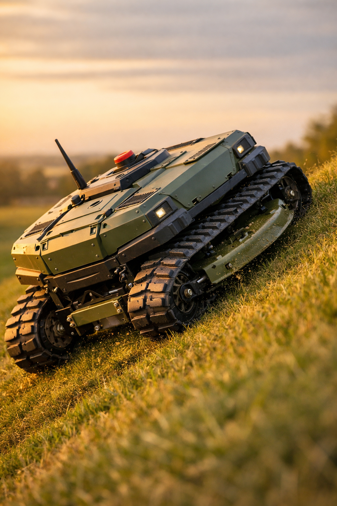
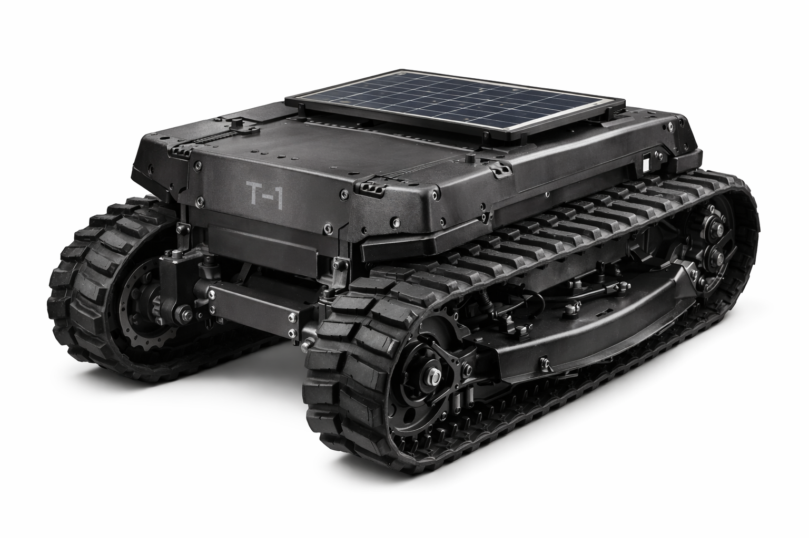
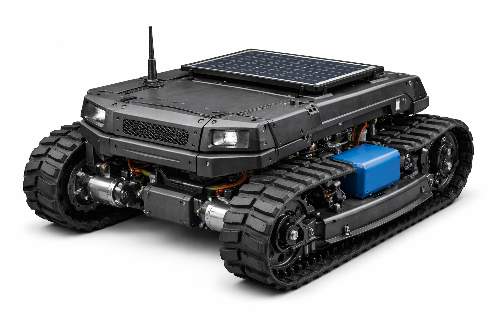

# Documento Técnico Executivo

# ROÇADEIRA ROBÓTICA | RobotGarden T-1

Versão: 1.0 (Protótipo)  
Data: 17/12/2025  
Autor: Wellington Mendes


  
Figura 2: Detalhe do design, mostrando a marcação "T-1" e a construção angular que favorece a durabilidade e a proteção dos componentes internos.
---

## 1️⃣ INTRODUÇÃO TÉCNICA

- Escopo do Projeto: Este documento detalha o projeto de engenharia, construção e validação de um protótipo funcional (T-1) de uma roçadeira robótica elétrica, de 12V, com tração por esteiras. O projeto foca em robustez extrema, segurança operacional e capacidade de operar em terrenos com inclinação de até 60° de forma contínua.
- Filosofia de Engenharia Adotada: A filosofia é a de "superdimensionamento inteligente" e "confiabilidade militar". Cada componente é selecionado e integrado para operar significativamente abaixo de seus limites de falha, garantindo durabilidade, segurança e previsibilidade. A arquitetura é modular para facilitar a manutenção, upgrades e a futura transição para um modelo de produção em série. A simplicidade mecânica é priorizada sobre a complexidade eletrônica para garantir a robustez em campo.
- Diferença entre Protótipo e Versão Industrial:
  - Protótipo (T-1): Foco na validação dos cálculos, geometria, distribuição de massa e desempenho bruto. A fabricação é artesanal (solda, corte manual), com componentes comerciais de prateleira (COTS) para agilizar o desenvolvimento. O custo é secundário à funcionalidade.
  - Versão Industrial (T-2 e além): Foco na otimização de custos, repetibilidade e certificação. Processos de fabricação em massa (corte a laser, dobra CNC, moldagem por injeção), componentes customizados (placas de circuito impresso, chassi otimizado) e design para montagem (DFA) serão implementados.

---

## 2️⃣ CONCEITO VISUAL DO PROJETO

As imagens a seguir representam o conceito de design e a aplicação do robô T-1.

  
Figura 1: Visão geral do protótipo T-1, destacando o sistema de esteiras, o chassi de baixo perfil e o painel solar auxiliar.

---

## 3️⃣ DEFINIÇÃO FINAL DE ARQUITETURA

- Justificativa Técnica do Uso de Esteiras: A exigência de operação em inclinações de 60°-70° elimina o uso de rodas. A tração por esteiras oferece uma área de contato superior, resultando em menor pressão sobre o solo e um coeficiente de atrito estático drasticamente maior. Isso se traduz em maior aderência em terrenos soltos, úmidos ou irregulares, e é a única arquitetura viável para prevenir o escorregamento e tombamento nos ângulos de ataque propostos.

- Comparação Técnica: Rodas × Pneus × Esteiras (para esta aplicação)

| Característica | Rodas (4x4) | Pneus (Agrícolas) | Esteiras de Borracha |
| --- | --- | --- | --- |
| Pressão no Solo | Alta | Média | Muito Baixa |
| Tração (Inclinação) | Baixa a Média | Média a Alta | Extremamente Alta |
| Flutuação (Solo Macio) | Ruim | Razoável | Excelente |
| Complexidade Mecânica | Média | Média | Alta |
| Manutenção | Baixa | Média | Alta |
| Veredito | Inviável | Inseguro/Marginal | Obrigatório |

- Arquitetura Modular do Sistema:

```
+-----------------------------------------------------+
|                   MÓDULO DE CONTROLE                |
|      (ESP32, Drivers, Sensores, Rádio, Fiação)      |
+-----------------------------------------------------+
|                                                     |
|     +------------------+   +--------------------+   |
|     | MÓDULO DE TRAÇÃO |   |  MÓDULO DE CORTE   |   |
|     | (Motores, Esteiras)|  | (Motor, Lâmina, Altura)|
|     +------------------+   +--------------------+   |
|                                                     |
+-----------------------------------------------------+
|                    MÓDULO DE ENERGIA                |
|          (Bateria LiFePO4, BMS, Disjuntores)        |
+-----------------------------------------------------+
```

---

## 4️⃣ ANÁLISE DE ESTABILIDADE E INCLINAÇÃO

- Centro de Gravidade (CG): O fator mais crítico para a estabilidade. O projeto deve posicionar o CG o mais baixo e centralizado possível. A bateria, sendo o componente mais pesado, será montada na base do chassi, entre os eixos das esteiras.
- Distribuição de Massa: Motores de tração e reduções devem ser montados em posição baixa. O motor de corte, embora precise de espaço para a lâmina, deve ter seu suporte integrado ao chassi de forma a não elevar desnecessariamente o CG.
- Limites Físicos Reais: O limite de tombamento ocorre quando a projeção vertical do CG ultrapassa a área de suporte da base (a borda da esteira). Para um ângulo θ, a altura do CG (h) e a metade da largura da base da esteira (b) devem satisfazer a condição tan(θ) < b / h. Para 70°, tan(70°) ≈ 2,75. Isso significa que a base de apoio (2b) precisa ser no mínimo 2,75 vezes a altura do CG. Esta é uma exigência severa que dita a geometria larga e baixa do robô.

  
Figura 3: Demonstração da capacidade de operar em alta inclinação, requisito chave do projeto.

- Estratégias para Atingir 70° em Segurança:
  1. Chassi Largo: Maximizar a distância entre as esteiras.
  2. CG Ultra-baixo: Posicionar todos os componentes pesados no fundo do chassi.
  3. Esteiras Longas: Aumentar a base de apoio longitudinal, prevenindo tombamento para frente/trás.
  4. Monitoramento Ativo (IMU): Alarme a 65° e parada/reversão segura ao se aproximar de 70°.

---

## 5️⃣ CÁLCULOS DE ENGENHARIA

Assumindo massa total do veículo (M) de 150 kg.

- Torque Necessário por Motor (Subida):
  - Força paralela à inclinação: Fg = M·g·sin(θ). Para θ = 70°: Fg ≈ 150·9,81·sin(70°) ≈ 1383 N
  - Atrito de rolamento: Fr ≈ μ_rr·M·g·cos(θ) ≈ 0,1·150·9,81·cos(70°) ≈ 50 N
  - Tração necessária: Ft = Fg + Fr ≈ 1433 N
  - Torque na roda (r = 0,15 m): T_roda = Ft·r ≈ 215 Nm
  - Por motor (2 motores): T_motor_nominal ≈ 107,5 Nm
  - Margem 50%: T_requerido ≈ 160 Nm (na roda)
  - Se motor 12V fornece 2 Nm, redução necessária ≈ 80:1

- Potência Mínima dos Motores de Tração:
  - Velocidade em subida: v = 0,5 m/s
  - Potência total: P = Ft·v ≈ 716,5 W
  - Por motor: ≈ 358 W
  - Considerando 80% de eficiência: ≈ 447,5 W
  - Recomendação: 2× motores ≥ 500 W cada.

- Potência Mínima do Motor de Corte:
  - Baseado em 2–3 HP de roçadeiras a gasolina.
  - Recomendação: BLDC 12V de 1200–1500 W.

- Consumo Elétrico Total:
  - Pico (subida + corte): P_total ≈ (2×500) + 1200 = 2200 W → I_max ≈ 183 A
  - Médio (plano, corte normal): P_med ≈ 1000 W → I_med ≈ 83 A

- Autonomia Estimada (12V, 200Ah LiFePO4):
  - E = 12·200 = 2400 Wh; E_util (80%) = 1920 Wh
  - t ≈ 1920 / 1000 ≈ 1,92 h

- Margens de Segurança: 50% (tração) e 30% (bateria).

---

## 6️⃣ PROJETO MECÂNICO DO CHASSI

- Material: Aço Carbono ASTM A36.
- Espessuras:
  - Base: chapa 4,75 mm (3/16").
  - Laterais/estrutura: 3 mm (1/8").
  - Reforços/suportes: 4–5 mm.
- Dimensões (conceito):
  - Largura total: 1000 mm
  - Comprimento de contato da esteira: 1200 mm
  - Altura do chassi: 250 mm
  - Vão livre: 150 mm
- Layout Interno: Bateria ao centro e baixo; motores de tração baixos; eletrônica em caixa selada; motor de corte frontal.
- Proteções: Ski-plates frontal/traseiro; gaiola superior.
- Fabricação artesanal: uso de dimensões padrão, furos de ajuste, solda MIG.

---

## 7️⃣ SISTEMA DE ESTEIRAS

- Tipo: Esteira de borracha com insertos metálicos e garras agressivas.
- Rodas motrizes dentadas: compatíveis com o passo da esteira.
- Tensores: mola + parafuso de ajuste.
- Rolos de apoio: múltiplos rolos inferiores distribuindo peso.
- Manutenção: inspeção de tensão, limpeza e verificação de desgaste.
- Vida útil (severo): 400–600 h (protótipo).

---

## 8️⃣ SISTEMA DE TRAÇÃO

- Motores: PMDC 12V, 500–750 W (ideal com freio).
- Reduções: sem-fim/coroa 80–90:1 (autoblocante).
- Acoplamentos: mandíbula com inserto elastomérico.
- Eixos: aço 1045/4140, FS ≥ 2,0.
- Rolamentos: rolos cônicos (eixos principais) e esferas selados (roletes).
- Skid steer: controle diferencial de velocidades; giro no eixo.

---

## 9️⃣ SISTEMA DE CORTE

- Lâmina: aço temperado tipo bar-blade ou pivotante (flail).
- Material: aço-mola SAE 5160/9260, 48–52 HRC.
- Dimensões: Ø 600–700 mm; espessura 6–8 mm.
- Motor de corte: BLDC 12V, ~1200 W (com ESC robusto).
- Proteções: embreagem de sobrecarga e/ou corte por sobrecorrente via ESC.
- Contra pedras: disco “stump jumper” para deslizar sobre obstáculos.

---

## 🔟 REGULAGEM DE ALTURA DA LÂMINA

- Atuador linear 12V, curso 100–150 mm, 1000 N.
- Controle: ponte H dedicada via ESP32; fins de curso obrigatórios.
- Segurança: fail-safe mecânico para não despencar por perda de energia.

---

## 1️⃣1️⃣ SISTEMA DE ENERGIA

- Bateria LiFePO4 12V, 200Ah, com BMS.
- Fusíveis:
  - Principal ANL 200A (entre bateria e contator).
  - 100A (cada tração), 150A (corte), 10A (controle).
- Disjuntores: principal 200A opcional; individuais conforme acima.
- Contator: 12V, 400A pico.
- Cabos:
  - Barramento: 70 mm² (AWG 2/0).
  - Motores: 35 mm² (AWG 2).
  - Controle: 4 mm² (AWG 12).
- Arquitetura: conduítes, terminais isolados, barramentos positivo/negativo.

---

## 1️⃣2️⃣ CARREGAMENTO SOLAR

- Função: auxiliar/manutenção (não alimenta operação contínua).
- Painel: 100–150 W (área útil ~1,0×0,8 m).
- Controlador: MPPT 12V, ≥15 A.
- Integração: ligado direto à bateria com fusível 15A.

---

## 1️⃣3️⃣ SISTEMA ELETRÔNICO DE CONTROLE

- Controlador: ESP32 (dual-core, Wi-Fi/BT, ADCs).
- Comunicação: LoRa 915 MHz.
- Sensores:
  - IMU: BNO055 (preferível) ou MPU-6050.
  - Corrente: ACS758 (um por motor de tração e corte).
  - Tensão: divisor resistivo.
  - Encoders: quadratura (para autonomia futura).
- Preparação para autonomia: interface serial/I2C para SBC (Raspberry Pi/Jetson).

---

## 1️⃣4️⃣ SOFTWARE (CÓDIGO)

- Lógica skid steer:
  - Joystick: eixo X (direção) e Y (aceleração).
  - V_base = map(Y, 0..1023 → -255..255); V_diff = map(X, 0..1023 → -255..255).
  - motor_L = clamp(V_base - V_diff); motor_R = clamp(V_base + V_diff).

- Fail-safe por inclinação:

```cpp
// Pseudo-código
imu.readAngles();
if (abs(imu.getPitch()) > 65 || abs(imu.getRoll()) > 65) {
  emergencyStop("Inclinação Crítica");
}
```

- Watchdog: habilitar WDT do ESP32 e alimentar no loop.
- Corte automático da lâmina: perda de link >1 s ou fail-safe → desligar ESC.

- Estrutura base (Arduino/ESP32):

```cpp
#include <LoRa.h>
#include <Wire.h>
#include <Adafruit_BNO055.h>

#define MOTOR_L_PWM 25
#define MOTOR_L_DIR 26
#define MOTOR_R_PWM 27
#define MOTOR_R_DIR 14
#define CUT_MOTOR_RELAY 32
#define EMERGENCY_STOP_PIN 4

Adafruit_BNO055 bno = Adafruit_BNO055(55);
volatile bool emergencyFlag = false;

void IRAM_ATTR emergencyISR() { emergencyFlag = true; }

void setup() {
  pinMode(EMERGENCY_STOP_PIN, INPUT_PULLUP);
  attachInterrupt(digitalPinToInterrupt(EMERGENCY_STOP_PIN), emergencyISR, FALLING);
  // init: Serial, LoRa, I2C, IMU, drivers, WDT...
}

void loop() {
  // feed WDT

  if (emergencyFlag || !isCommLinkOk() || isAngleCritical()) {
    performSafeStop();
    while(true){} // estado seguro
  }

  // ler joystick via LoRa, ler sensores, calcular skid steer, acionar motores
  delay(20);
}

void performSafeStop() {
  // desligar tração e corte, sinalizar
}

bool isAngleCritical() { /* ler IMU e avaliar */ return false; }
bool isCommLinkOk()    { /* timeout de rádio  */ return true;  }
```

---

## 1️⃣5️⃣ PLANO DE TESTES

1. Bancada: acionamento, resposta ao joystick, sensores, botões de emergência.
2. Tração: corrente em aceleração e velocidade em terreno plano.
3. Inclinação (controlado): rampas 10°→60°, verificar corrente/estabilidade; cabos de segurança antes de tentar >60°.
4. Corte: grama baixa→média→mato denso; monitorar corrente do ESC.
5. Segurança: perda de comunicação, botões de emergência físico/virtual, fail-safe por inclinação.

---

## 1️⃣6️⃣ PLANO DE INDUSTRIALIZAÇÃO

- Chassi: migrar para corte a laser e dobra CNC; otimização por FEA.
- Eletrônica: PCB custom integrando ESP32, drivers e conectores.
- Componentes: compras em volume e parcerias para customização.
- Padronização: fixadores e conectores.
- Redução de custo: alternativas sem sacrificar robustez.
- Modularização: troca rápida de módulos em campo.
- Certificações: prever requisitos CE/NR-12 (circuitos de emergência redundantes, proteções físicas).

---

## 1️⃣7️⃣ SEGURANÇA

- FMEA simplificado:
  - Perda de controle em inclinação → tombamento → IMU + watchdog + redutor autoblocante + testes.
  - Lâmina atinge pessoa/animal → ferimentos → botão de emergência físico, corte por perda de link, treinamento e sinalização.
  - Curto/Incêndio → perda do equipamento → LiFePO4, fusíveis/disjuntores, dimensionamento de cabos, conduítes, monitoramento térmico.
- Botões de emergência: cogumelo no chassi (corta contator) e botão virtual no controle.
- Corte por falha: qualquer falha crítica → desligar tração e corte.
- Operação segura: operador treinado, distância segura, área isolada.

---

## 1️⃣8️⃣ PLANO DE COMPRAS (BOM)

### Módulo do Chassi e Estrutura
| Componente | Especificação Técnica Sugerida | Quant. | Função no Projeto | Termo de Busca |
| --- | --- | --- | --- | --- |
| Chapa de Aço Carbono | ASTM A36, 4.75mm (3/16") | 1 (2m²) | Base do chassi | comprar chapa aço carbono 3/16 |
| Chapa de Aço Carbono | ASTM A36, 3mm (1/8") | 1 (3m²) | Laterais e suportes | comprar chapa aço carbono 1/8 |
| Perfil Metálico | Cantoneira 1.5"x1/8" ou Metalon 30×30 | 6 m | Reforços e suportes | cantoneira aço 1.5 polegadas |

### Módulo de Tração
| Componente | Especificação | Quant. | Função | Termo de Busca |
| --- | --- | --- | --- | --- |
| Motores de Tração | PMDC 12V, 500–750 W (com freio) | 2 | Potência de locomoção | motor 12v 500w com freio |
| Caixa de Redução | Sem-fim/coroa 80–90:1 | 2 | Multiplica torque (autoblocante) | redutor sem fim coroa |
| Esteiras de Borracha | 100–150 mm, ~3000 mm, garras | 2 | Tração | esteira de borracha para robô |
| Rodas Motrizes | Compatível com passo da esteira | 2 | Transfere torque | roda motriz esteira borracha |
| Rolos de Apoio | Ø 80–100 mm com rolamentos | 8–12 | Suporte/guia | roda com rolamento para esteira |
| Eixos de Aço | 1045, Ø ~25 mm | 2 m | Eixos motriz/apoio | eixo aço 1045 25mm |
| Mancais | Pillow Block p/ Ø25 mm | 4 | Suporte dos eixos | mancal pillow block p205 |

### Módulo de Corte e Regulagem
| Componente | Especificação | Quant. | Função | Termo de Busca |
| --- | --- | --- | --- | --- |
| Motor de Corte | BLDC 12V, 1200–1500 W | 1 | Gira a lâmina | motor brushless 12v 1200w |
| ESC | 12V, ≥150 A cont./200 A pico | 1 | Controla motor de corte | esc 12v 150a brushless |
| Lâminas | Pivotantes (flail), aço-mola | 1 kit | Corte | lâmina pivotante roçadeira |
| Atuador Linear | 12V, 150 mm, 1000 N | 1 | Ajuste de altura | atuador linear 12v 150mm 1000n |

### Módulo de Energia
| Componente | Especificação | Quant. | Função | Termo de Busca |
| --- | --- | --- | --- | --- |
| Bateria LiFePO4 | 12V, 200Ah, com BMS | 1 | Armazenamento de energia | bateria lifepo4 12v 200ah |
| Carregador | 12V LiFePO4, 20 A | 1 | Carga em rede | carregador lifepo4 12v 20a |
| Painel Solar | 100–150 W mono | 1 | Auxiliar/manutenção | painel solar 150w |
| Controlador MPPT | 12V, ≥15 A | 1 | Otimiza carga solar | controlador mppt 15a |
| Contator | 12V, 400 A pico | 1 | Chave geral | contator automotivo 12v 400a |
| Fusível ANL | 200 A + porta-fusível | 1 | Proteção geral | fusível anl 200a |
| Disjuntores DC | 150 A (1), 100 A (2) | 3 | Proteção de ramos | disjuntor dc 100a |

### Controle e Eletrônica
| Componente | Especificação | Quant. | Função | Termo de Busca |
| --- | --- | --- | --- | --- |
| ESP32 | DevKitC V4 | 1 | Controlador central | esp32 devkitc |
| Driver de Tração | Ponte H dupla 2×60 A (ex. Sabertooth) | 1 | Acionamento de motores | sabertooth 2x60 motor driver |
| Rádio LoRa | 915 MHz (ex. RYLR896) | 2 | Comunicação | módulo lora rylr896 |
| Joystick | Analógico 2 eixos | 2 | Comando | joystick analógico 2 eixos |
| IMU | BNO055 ou MPU-6050 | 1 | Inclinação | sensor imu bno055 |
| Sensor de Corrente | ACS758-200A | 3 | Monitoramento | sensor de corrente acs758 200a |
| Botão Emergência | Cogumelo NF com trava | 1 | Segurança | botão de emergência cogumelo |

### Miscelânea
| Componente | Especificação | Quant. | Função |
| --- | --- | --- | --- |
| Cabos de Potência | 70, 35, 16 mm² | Lotes | Alta corrente |
| Cabos de Controle | 22 AWG | 1 kit | Sinais |
| Terminais de Crimp | Olhal p/ 70/35 mm² | 1 kit | Conexões seguras |
| Parafusos/Porcas | M6–M12 | 1 kit | Fixação |
| Caixa Hermética | IP65 aprox. | 1 | Proteção eletrônica |

---

## 1️⃣9️⃣ PLANO DE CUSTO DE PRODUÇÃO (ESTIMATIVA)

| Categoria | Componente | Especificação | Qtde | Custo Unit. (BRL) | Custo Total (BRL) | Observações |
| --- | --- | --- | --- | ---: | ---: | --- |
| Chassi e Estrutura | Aço (chapas/perfis) | ASTM A36, ~30 kg | 1 | 350,00 | 350,00 | Preço varejo |
|  | Subtotal Estrutura |  |  |  | **350,00** |  |
| Sistema de Tração | Motores tração | 12V 500–750 W c/redutor | 2 | 1.200,00 | 2.400,00 | Alta robustez |
|  | Esteiras | 100–150 mm | 2 | 600,00 | 1.200,00 | Importado |
|  | Rodas/roletes | Kit usinado | 1 | 800,00 | 800,00 | Estimativa |
|  | Subtotal Tração |  |  |  | **4.400,00** |  |
| Sistema de Corte | Motor de corte | BLDC 12V 1200 W | 1 | 900,00 | 900,00 |  |
|  | Lâminas | Pivotantes | 1 | 250,00 | 250,00 |  |
|  | Atuador linear | 12V, 1000 N | 1 | 450,00 | 450,00 |  |
|  | Subtotal Corte |  |  |  | **1.600,00** |  |
| Sistema de Energia | Bateria LiFePO4 | 12V 200Ah | 1 | 4.500,00 | 4.500,00 | Item mais caro |
|  | Painel + MPPT | 100–150 W | 1 | 700,00 | 700,00 |  |
|  | Contator | 12V, 400A pico | 1 | 300,00 | 300,00 |  |
|  | Disjuntores/Fusíveis | Kit | 1 | 200,00 | 200,00 |  |
|  | Subtotal Energia |  |  |  | **5.700,00** |  |
| Eletrônica/Controle | Driver tração | 2×60 A (Sabertooth) | 1 | 2.800,00 | 2.800,00 | Alto custo |
|  | Rádio/Joystick | LoRa + controle | 1 | 500,00 | 500,00 |  |
|  | ESC corte | 12V ≥150 A | 1 | 400,00 | 400,00 |  |
|  | ESP32 + Sensores | Kit | 1 | 250,00 | 250,00 |  |
|  | Subtotal Eletrônica |  |  |  | **3.950,00** |  |
| Miscelânea | Cabos/Parafusos/Conectores | Diversos | 1 | 900,00 | 900,00 |  |
|  | Subtotal Miscelânea |  |  |  | **900,00** |  |

### Resumo
- A. Materiais e Componentes: R$ 16.900,00  
- B. Serviços de Fabricação (corte/dobra/solda): R$ 2.500,00  
- C. Mão de Obra (80 h × R$ 60): R$ 4.800,00  
- Custo de Produção (A+B+C): R$ 24.200,00  
- D. Contingência (15%): R$ 3.630,00  
- Investimento Total Estimado: ~ R$ 27.830,00

---

## 2️⃣0️⃣ CONSIDERAÇÕES FINAIS

O documento compila especificações, cálculos, arquitetura e listas de materiais suficientes para fabricação do protótipo T-1, com ênfase em segurança e robustez para terrenos severos. Preparado para futuro upgrade de autonomia.
